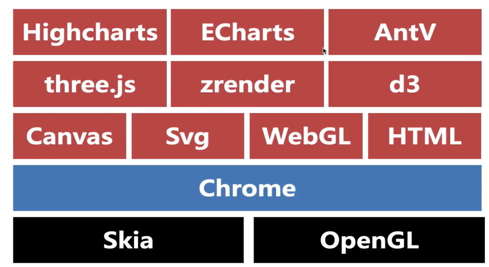

# aiyou-charts
玩数据可视化

## 前端可视化解决方案

### canvas 画布

1. basic
2. 图片压缩

01-basic

1. 在html中编写canvas标签，得指定宽高
2. 获取canvas 的 dom
3. 获取canvas 上下文对象
4. 设置你要的绘图属性
5. 调用绘图的API方法

> **HELP**
> [html5 canvas 手册](https://www.w3school.com.cn/tags/html_ref_canvas.asp)

02-canvas-compress

1. 

### svg 矢量图

1. basic

01-basic

1. 在html中编写svg标签，指定宽高
2. 编写svg绘图标签
3. 编写绘图标签的属性和样式

> **HELP**
> [html5 svg 手册](https://www.w3school.com.cn/svg/svg_reference.asp)

### webgl 3d绘图

webgl 是一个3d绘图协议，可以借助硬件显卡让动画更加流程，也是通过canvas来实现的，但是属于另一套体系。

### zrender 2d绘图引擎

1. basic

01-basic

1. 引入zrender的类库
2. 编写一个div容器
3. 初始化zrender容器对象
4. 初始化zrender绘图对象（矩形、折现、圆、点...）
5. 调用zrender 的 add方法进行绘图

> **HELP**
> [zrender 官网](https://ecomfe.github.io/zrender-doc/public/)
> [zrender 官网-实例](https://ecomfe.github.io/zrender-doc/public/examples.html)
> [zrender 官网-文档](https://ecomfe.github.io/zrender-doc/public/api.html)
> [zrender 官网-实例代码](https://github.com/ecomfe/zrender-doc/tree/master/public/examples)

### d3 数据驱动dom 图形绘制

1. basic

01-basic

1. 引入d3的类库
2. 通过调用d3的API将html的dom转换成d3的dom
3. 调用d3的API(datum、data、text...)来实现以数据驱动DOM

> **HELP**
> [d3 官网](https://d3js.org/)
> [d3 案例](https://observablehq.com/@d3/gallery)
> [d3 学习之路](https://zhuanlan.zhihu.com/p/38001672)
> [d3 绘制思维导图](https://github.com/reclay/vue-d3-tree-example)

### three.js 基于webgl 3d 图形绘制

这是一个基于webgl的3d图形绘制库

1. basic

01-basic

> **HELP**
> [开源地址](https://github.com/mrdoob/three.js)
> [官方文档](https://threejs.org/docs/)

